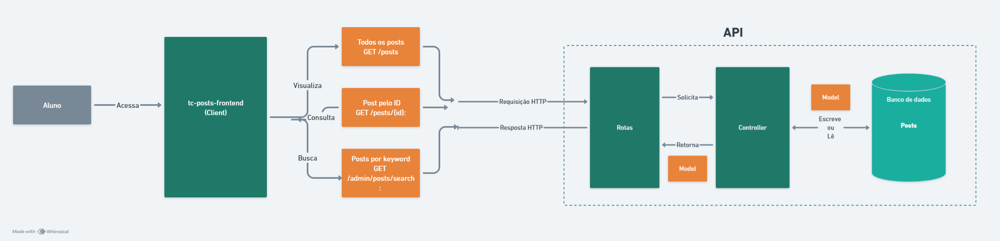

# Blog Educacional

Esta aplicação se propõe a implementar o front-end de um blog, o mesmo foi construído com React, TypeScript e Vite. A plataforma permite que usuários visualizem posts públicos e que professores autenticados gerenciem posts na área administrativa.

Portanto o blog visa consumir as rotas implementadas [na fase anterior do projeto](https://github.com/BernardoS/tc-posts-api) para disponibilizar, para alunos e professores, um serviço de comunicação e gerenciamento de **posts**.

Esta aplicação foi desenvolvida visando cumprir os requisitos estabelecidos pelo Tech-Challenge da Pós-Tech em Desenvolvimento Full-Stack da FIAP.

## Estrutura da aplicação e tecnologias utilizadas
A aplicação foi estruturada de forma a separar claramente as responsabilidades de cada componente e serviço. Abaixo, detalhamos a estrutura da aplicação e o fluxo de navegação.

**React**: Biblioteca JavaScript para construção de interfaces de usuário. Utilizamos React para criar componentes reutilizáveis e gerenciar o estado da aplicação de forma eficiente.

**TypeScript**: Superset do JavaScript que adiciona tipagem estática. Utilizamos TypeScript para melhorar a qualidade do código, facilitando a detecção de erros durante o desenvolvimento.

**Vite**: Ferramenta de build rápida e moderna para projetos front-end. Utilizamos Vite para acelerar o processo de desenvolvimento com hot module replacement (HMR) e build otimizado.

**Firebase**: Plataforma de desenvolvimento de aplicativos do Google. Utilizamos Firebase para autenticação de usuários e armazenamento de dados em tempo real.

**Axios**: Biblioteca para fazer requisições HTTP. Utilizamos Axios para consumir a API REST implementada na fase anterior do projeto.

**React Router**: Biblioteca para gerenciamento de rotas em aplicações React. Utilizamos React Router para definir e proteger as rotas da aplicação.

**Styled Components**: Biblioteca para estilização de componentes em React. Utilizamos Styled Components para aplicar estilos de forma modular e dinâmica.

## Setup Inicial

Para configurar e rodar a aplicação localmente, siga os passos abaixo:

#### 1. Clone o repositório:
   ```sh
   git clone https://github.com/BernardoS/saiba-mais/
  ```
#### 2. Instale as dependências:
   ```sh 
   npm install
  ```
#### 3. Crie um arquivo .env na raiz do projeto com as seguintes variáveis:
   ```sh
   VITE_BLOG_API_KEY=your_api_key
   VITE_BLOG_AUTH_DOMAIN=your_auth_domain
   VITE_BLOG_PROJECT_ID=your_project_id
   VITE_BLOG_STORAGE_BUCKET=your_storage_bucket
   VITE_BLOG_MESSAGING_SENDER_ID=your_messaging_sender_id
   VITE_BLOG_APP_ID=your_app_id
   VITE_BLOG_MEASUREMENT_ID=your_measurement_id
  ```
#### 4. Inicie o servidor de desenvolvimento:
  ```sh
   npm run dev
  ```
#### 5. Baixe e execute a última versão da aplicação servidor:
  ```sh
   git clone https://github.com/BernardoS/tc-posts-api.git
  ```

## Docker

A aplicação também possuí os arquivos de configuração necessários para ser executada usando Docker, siga os passos abaixo:

#### 1. Construa a imagem Docker:
  ```sh
   docker-compose 
  ```
#### 2. Inicie os containers:
  ```sh
   docker-compose up
   ```

## Arquitetura da Aplicação
  ### Componentes Principais

   **HomePage**: Página inicial que lista todos os posts públicos.

   **PostPage**: Página que exibe os detalhes de um post público.

   **LoginPage**: Página de login para autenticação de usuários.

   **AdminPage**: Página de administração para listar e gerenciar posts (acessível apenas para usuários autenticados).

   **NewPostPage**: Página para criar um novo post (acessível apenas para usuários autenticados).

   **AdminPostDetailPage**: Página de detalhes do post na área administrativa (acessível apenas para usuários autenticados).
  
  ### Componentes Reutilizáveis

   - **NavBar**: Componente de navegação.
   - **PostItem**: Componente para exibir um item de post.
   - **PostList**: Componente para listar posts.
   - **CreatePostForm**: Formulário para criar um novo post.
   - **UpdatePostForm**: Formulário para atualizar um post existente.
   - **PrivateRoute**: Componente para proteger rotas privadas.
   - **SearchBar**: Componente de barra de pesquisa.

  ### Serviços
   - **api.ts**: Configuração do Axios para chamadas de API.

   - **firebase.ts**: Configuração do Firebase.

  ### Guia de Uso e Navegação

  

   **Home Page (/)**: Exibe a lista de posts públicos. Inclui uma barra de pesquisa para filtrar posts.

   **Post Page (/post/:id)**: Exibe os detalhes de um post público.

   **Public Post Detail Page (/posts/:id)**: Exibe os detalhes de um post na área pública

   

   **Login Page (/login)**: Página de login para autenticação de usuários.

   **Admin Page (/admin)**: Página de administração acessível apenas para usuários autenticados. Exibe a lista de posts com opções para editar e excluir. Inclui um botão "Adicionar post" que redireciona para a página de criação de novo post.

   **Admin Post Detail Page (/admin/posts/:id)**: Exibe os detalhes de um post na área administrativa. Inclui opções para editar e excluir o post.

   **New Post Page (/admin/new-post)**: Página para criar um novo post. Inclui um formulário com campos para título, descrição, conteúdo e autor.

## Desafios Encontrados

### Estruturação de Componentes

Uma das principais dificuldades encontradas foi a estruturação dos componentes que seriam utilizados na aplicação. Inicialmente, alguns componentes foram criados de forma monolítica, o que dificultou a manutenção e a reutilização do código. Foi necessário refatorar e recriar alguns componentes para que fossem mais modulares e reutilizáveis. Por exemplo, o componente `CreatePostForm` foi dividido em componentes menores para facilitar a manutenção e a adição de novas funcionalidades.

### Gerenciamento de Estado

Outra dificuldade comum foi o gerenciamento de estado. Optamos por utilizar hooks do React, como `useState` e `useEffect`, para gerenciar o estado local dos componentes. No entanto, à medida que a aplicação crescia, a complexidade do gerenciamento de estado aumentava. Consideramos a utilização de bibliotecas como Redux ou Context API para gerenciar o estado global da aplicação, mas decidimos manter a simplicidade com os hooks do React para este projeto.
